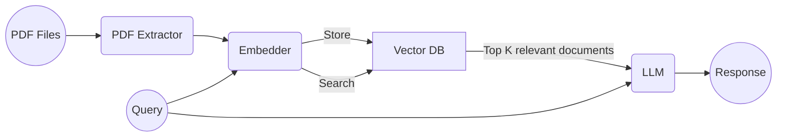

# RAG Based Chatbot

As a large language model, I .... kidding :)

**Author**: Gevorg Nersesian

**Contact Info**: gevorg_nersesian@edu.aua.am

## Architecture

The proposed pipeline. 

### PDF Exractor

**Tech Stack**: PyMuPDF
**Benefits**: high speed, ability to extract complex structured data

After analysing the given PDF example, I noticed that aside from regular text it also contains icons, tables and pictures. Thus we need to find an extractor module that will be able to parse the valuable information in those formats as well. Simple web search provided an article where the author compares some popular libraries for PDF data extraction.

**Source**: [Comparison of Python PDF Extractors](https://abhiyantimilsina.medium.com/a-comparative-analysis-of-pdf-extraction-libraries-choosing-the-fastest-solution-3b6bd8588498)

### Embedder

**Tech Stack**: text-embedding-3-large (OpenAI's Embeddings)
**Benefits**: fast, supports a rather spacious amount of dimensions 

The article attached reports a thorough research on the performance of three embedding models `text-embedding-3-large`, `voyage-lite-02-instruct`, and `UAE-large-V1`.  Not only OpenAI's model performs much faster, it also has 3 times as many dimentions as the other two.

**Source**: [Comparison of Embedding Models](https://www.mongodb.com/developer/products/atlas/choose-embedding-model-rag/)

### Vector DB
**Tech Stack**: Pinecone
**Benefits**: developed specifically for machine learning integration

There is no one correct choice in this category as most of the vector databases used for AI projects will integrate well into this project too. `Pinecone` is a popular choice due to it's easy of use and good performance.

**Source**: [Vector DB Choice for AI Projects](https://blog.fabrichq.ai/vector-databases-and-how-to-pick-the-right-one-de8a5fde73df)

### LLM

**Tech Stack**: GPT4o or Gemini 1.5 Pro
**Benefits**: good speed/intelligence tradeoff

The first source present the three main variables to consider to make the right choice in LLMs: intelligence, speed, context window. It is important to understand that out chatbot must be able to answer hard questions about specifications of ecomplex equioment as well as take in large prompt. Thus, intelligence plays the biggest role in this case, and choosing industry leader's like OpenAI's `GPT4o` or Google's `Gemini 1.5 Pro` seems only logical.
In contrast, by choosing cheaper thus less intelligent models like `GPT3 Turbo`, the risk of hallucinations increases significantly which might lead to damaging the expensive equipment.

**Sources**: [Using OpenAI's LLMs](https://medium.com/the-business-of-ai/how-to-pick-the-best-llm-for-your-ai-project-3a9db7b3ba2c), [Comparison of Leading LLMs](https://mindsdb.com/blog/navigating-the-llm-landscape-a-comparative-analysis-of-leading-large-language-models)

## Potential Challenges

* The LLMs chosen have a great (the best) specifications and thus a higher cost. For this reason, it would be efficient to implement caching algorithms to answer most popular questions as well as further fine-tune the model to decrease the need for multiple API calls.
* Embedding a large volume of text data can be time-consuming and resource-intensive. To solve this, it is necessary too implement efficient data management strategies like incremental embedding and indexing for large datasets, and utilize distributed computing to scale the process and optimize resource usage.
* One particular challenge for our set problem is data extraction. Manuals use complex structuring techniques like schemes and tables to deliever the large amount of information compactly. This is why, it is just as complex to 'unwrap' all of that data. Text, table, and image data should be extracted processed separately before being combined and sent to the embedder. In case if `PyMuPDF` doesnt show good results on table extraction, `pdfminer.six` will be considered to implement that task and only then join the retrieved data.

## Expected Performance

### Chatbot answers
1. ***"How wide should the hole be for installing a wall embedded pipe?"*** (in the manual)
2. ***"What is the minimum bend radius for a gas pipe with an outer diameter of 5/8 inch in a 24 class installation?"***  (in a table in the manual)
3. ***"How to apply mineral oil on a flared part of the pipe end?"*** (Warning not to use mineral oil in manual)
4. ***"What is this darker rectangular part on the right if you look at the air conditioner from the front?"*** (from the pictures in the manual) 
6. ***"Which air conditioning model uses 2 screws in the front and 4 screws on the back?"*** (cross-manual search)

### Chatbot fails to answer
6. ***"Recommend me an oil brand to apply on my fan mechanism to make it run smoother."***  (Chatbot is only provided the user prompt and PDFs, it has no data on which brands might be better than others)
7. ***"Book a technician to come take a look at my air conditioning."***  (Chatbot cannot do external activities)
8. ***"My kid ate all the ice cream again. How do I ground him to teach a lesson?"***  (the primary meaning of a word "ground" for this chatbot would be the one related to circuits and electronics, thus it will get confused and respond with something that is related to home equipment installation)
9. ***"Tell me about filter()"*** (same as above, it will consider "filter" in context of equipment installation, and not coding)
10. ***""Why is my dishwasher makes weird sounds?"*** (surface level questions are not covered in the manual as it is hard to answer them without a proper examination)
